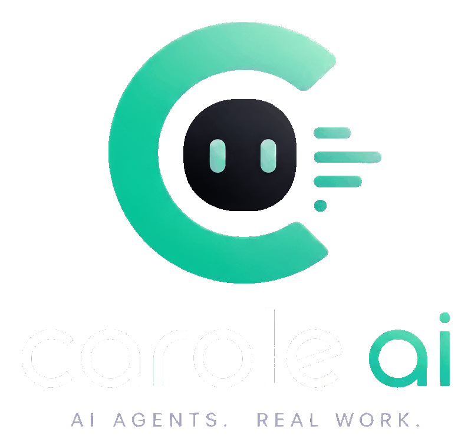

<p align="center">
  
</p>

# Carole.ai

**AI AGENTS. REAL WORK.**

Carole.ai is an advanced AI-powered assistant and development environment with a robust suite of features including Hybrid GraphRAG, zero-cost meeting integration, MCP (Model Context Protocol) expansion, and a native real-time Kanban board.

## Features

- **Hybrid GraphRAG**: Combines Dense (LanceDB) and Sparse memory retrieval, mapped alongside a real-time `networkx` Code Graph for unparalleled context awareness.
- **Zero-Cost Meeting Integration**: Seamlessly integrates with Google Meet via Playwright DOM caption scraping and native chat injection.
- **MCP Expansion**: Features a universal Model Context Protocol firewall and dynamic ToolRegistry, expanding the ecosystem of available models and tools securely.
- **Native Real-Time Kanban**: EventBus-driven split-screen project management for dynamic task tracking and synchronization.

## Local Setup Instructions

Follow these steps to get Carole.ai running locally.

### 1. Prerequisites
- Docker and Docker Compose
- Node.js (v18+ recommended)
- Python (v3.10+ recommended)

### 2. Environment Variables
Create a `.env` file in the root directory (or update the existing one) with the necessary variables. At a minimum, you'll need:

```env
OPENROUTER_API_KEY=your_openrouter_api_key_here
# Add other required API keys or database URLs as needed
```

### 3. Start the Backend (FastAPI)
The backend requires Python and FastAPI. We recommend using a virtual environment.

```bash
cd backend
python -m venv venv
source venv/bin/activate  # On Windows use: venv\Scripts\activate
pip install -r requirements.txt
uvicorn main:app --reload
```

### 4. Start the Frontend (Next.js)
The frontend is built with Next.js. Open a new terminal window to start it.

```bash
cd frontend
npm install
npm run dev
```

### 5. Access the Application
- Frontend: [http://localhost:3000](http://localhost:3000)
- Backend API Docs: [http://localhost:8000/docs](http://localhost:8000/docs)
