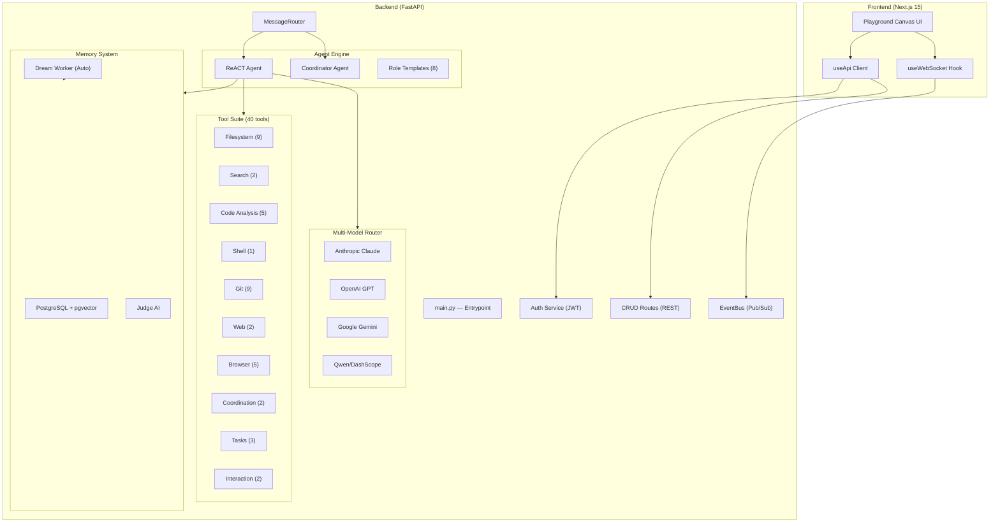

# Carole.ai — Final Engineering Report

> **Date:** May 31, 2026  
> **Verification:** ✅ All 30 Python files — syntax OK | ✅ TypeScript — zero errors

---

## Architecture Overview



---

## Backend Modules (30 files)

### Core Infrastructure

| File | Lines | Responsibility |
|------|-------|----------------|
| `main.py` | 243 | FastAPI entrypoint, lifespan, WebSocket, CORS, route wiring |
| `database.py` | 79 | Async SQLAlchemy engine, session factory, `FORCE_DB_RECREATE` support |
| `models.py` | 131 | 7-table schema: User, Project, Team, Agent, Message, Learning, Task |
| `event_bus.py` | 77 | Asyncio pub/sub with 100-event history buffer per topic |
| `message_router.py` | 141 | @mention parsing, DB persistence, agent loop spawning |

### Agent Engine

| File | Lines | Responsibility |
|------|-------|----------------|
| `react_agent.py` | 225 | ReACT loop with conversation history, retry/backoff, streaming |
| `coordinator.py` | 187 | Multi-worker delegation, `<task-notification>` XML collection |
| `role_templates.py` | 257 | 8 pre-built role archetypes with skills, prompts, permissions |

### LLM & AI

| File | Lines | Responsibility |
|------|-------|----------------|
| `multi_model_router.py` | 310 | 4-provider streaming (Claude, GPT, Gemini, Qwen) + embeddings |
| `judge_evaluator.py` | 61 | LLM-based tool safety appraisal (APPROVE/DENY) |
| `auto_dream.py` | 164 | Background memory consolidation (messages → learnings via pgvector) |

### API Layer

| File | Lines | Responsibility |
|------|-------|----------------|
| `crud_routes.py` | 645 | 30+ REST endpoints for all entities + role templates + semantic search |
| `auth_routes.py` | 68 | JWT signup, login, get-me endpoints |
| `auth_service.py` | 177 | Password hashing, JWT creation/verification |

### Tool Modules

| File | Lines | Tools | Responsibility |
|------|-------|-------|----------------|
| `tool_executor.py` | 572 | — | Permission gating + 40 tool registrations + wrapper functions |
| `tool_registry.py` | 127 | — | Dynamic registry, LLM prompt generation, plugin hot-loading |
| `file_tools.py` | 257 | 9 | read, write, edit, append, delete, list, copy, move, mkdir + grep, glob |
| `code_analysis_tools.py` | 170 | 5 | find_function, find_todos, count_lines, analyze_imports, check_syntax |
| `shell_tools.py` | 99 | 1 | Async subprocess with streaming stdout/stderr to EventBus |
| `git_tools.py` | 103 | 9 | status, diff, log, add, commit, checkout, push, stash, clone |
| `web_tools.py` | 105 | 2 | Tavily search + URL text extraction |
| `browser_tool.py` | 115 | 5 | Playwright navigate, screenshot, click, type, extract |
| `browser_pool.py` | 68 | — | Per-agent isolated Chromium contexts |
| `agent_tools.py` | 117 | 2 | spawn_agent (with task_id tracking), send_message |
| `task_tools.py` | 124 | 3 | create/list/update tasks with EventBus broadcast |
| `interaction_tools.py` | 64 | 2 | ask_user (blocking Q&A), sleep |
| `meeting_tool.py` | 107 | — | Audio transcription, meeting notes generation, TTS |
| `voice_stt_tts.py` | 76 | — | OpenAI Whisper STT + TTS-1 synthesis |
| `plugin_decorator.py` | 46 | — | `@carole_tool` decorator for drop-in plugins |

---

## Tool Registry (40 Tools)

| # | Tool | Category | Permission | Description |
|---|------|----------|------------|-------------|
| 1 | `read_file` | filesystem | safe | Read file contents |
| 2 | `write_file` | filesystem | judge | Create or overwrite file |
| 3 | `edit_file` | filesystem | judge | Replace specific text block |
| 4 | `append_file` | filesystem | judge | Append content to file |
| 5 | `list_directory` | filesystem | safe | List directory contents |
| 6 | `delete_file` | filesystem | human | Delete a file |
| 7 | `copy_file` | filesystem | judge | Copy file to new location |
| 8 | `move_file` | filesystem | judge | Move or rename file |
| 9 | `create_directory` | filesystem | safe | Create new directory |
| 10 | `grep_search` | search | safe | Regex content search |
| 11 | `glob_search` | search | safe | Glob pattern file discovery |
| 12 | `execute_command` | shell | judge | Run shell command with streaming |
| 13 | `git_status` | git | safe | Show git status |
| 14 | `git_diff` | git | safe | Show uncommitted changes |
| 15 | `git_add` | git | judge | Stage files |
| 16 | `git_commit` | git | judge | Create commit |
| 17 | `git_log` | git | safe | Show commit history |
| 18 | `git_checkout` | git | judge | Switch/create branch |
| 19 | `git_push` | git | human | Push to remote |
| 20 | `git_stash` | git | judge | Stash/unstash changes |
| 21 | `git_clone` | git | human | Clone repository |
| 22 | `find_function` | code_analysis | safe | Find function/class definitions |
| 23 | `find_todos` | code_analysis | safe | Find TODO/FIXME comments |
| 24 | `count_lines` | code_analysis | safe | LOC metrics |
| 25 | `analyze_imports` | code_analysis | safe | List imports in file |
| 26 | `check_syntax` | code_analysis | safe | Validate Python syntax |
| 27 | `web_search` | web | safe | Tavily web search |
| 28 | `web_fetch` | web | safe | Fetch URL text content |
| 29 | `browser_navigate` | browser | judge | Navigate + screenshot |
| 30 | `browser_screenshot` | browser | judge | Capture screenshot |
| 31 | `browser_click` | browser | judge | Click element by selector |
| 32 | `browser_type` | browser | judge | Type into input element |
| 33 | `browser_extract_text` | browser | safe | Extract page text |
| 34 | `spawn_agent` | coordination | safe | Spawn teammate's ReACT loop |
| 35 | `send_message` | coordination | safe | Send team chat message |
| 36 | `create_task` | task | safe | Create task on board |
| 37 | `list_tasks` | task | safe | List team tasks |
| 38 | `update_task` | task | safe | Update task status |
| 39 | `ask_user` | interaction | safe | Ask human and wait for reply |
| 40 | `sleep` | interaction | safe | Pause execution |

---

## Role Templates (8)

| Role | Display Name | Recommended Model | Personality |
|------|-------------|-------------------|-------------|
| Coordinator | Team Coordinator | gpt-4o | casual |
| Coder | Software Engineer | claude-sonnet-4 | witty |
| Reviewer | Code Reviewer / QA | gpt-4o | mentor |
| Researcher | Research Analyst | gpt-4o-mini | professional |
| DevOps | DevOps Engineer | gpt-4o-mini | professional |
| Designer | UI/UX Designer | claude-sonnet-4 | casual |
| Tester | Test Engineer | gpt-4o-mini | professional |
| Technical Writer | Documentation Specialist | gpt-4o-mini | mentor |

Each template includes: suggested names, personality, skills list, custom instructions, recommended model, and recommended tool permissions.

---

## REST API Endpoints (35 total)

### Authentication
| Method | Path | Description |
|--------|------|-------------|
| POST | `/api/auth/signup` | Create account + return JWT |
| POST | `/api/auth/login` | Authenticate + return JWT |
| GET | `/api/auth/me` | Get current user from Bearer token |

### CRUD
| Method | Path | Description |
|--------|------|-------------|
| POST | `/api/users` | Create user |
| GET | `/api/users` | List users |
| DELETE | `/api/users/{id}` | Delete user |
| POST | `/api/projects` | Create project |
| GET | `/api/projects` | List projects |
| GET | `/api/projects/single/{id}` | Get single project |
| DELETE | `/api/projects/{id}` | Delete project |
| POST | `/api/teams` | Create team |
| GET | `/api/teams/{project_id}` | List teams for project |
| GET | `/api/teams/single/{id}` | Get single team |
| DELETE | `/api/teams/{id}` | Delete team |
| POST | `/api/agents` | Create agent (with skills, instructions, personality) |
| GET | `/api/agents/{team_id}` | List agents for team |
| PUT | `/api/agents/{id}` | Update agent (auto-rebuilds prompt) |
| DELETE | `/api/agents/{id}` | Delete agent |
| GET | `/api/messages/{team_id}` | List messages |
| GET | `/api/messages/search/{team_id}` | Semantic vector search |
| POST | `/api/tasks` | Create task |
| GET | `/api/tasks/{team_id}` | List tasks |
| PUT | `/api/tasks/{id}` | Update task |
| POST | `/api/learnings` | Create learning (with embedding) |
| GET | `/api/learnings/{project_id}` | List learnings |
| GET | `/api/tools` | List registered tools |
| GET | `/api/role-templates` | List all role templates |
| GET | `/api/role-templates/{role}` | Get specific template |
| POST | `/api/tools/approve/{tx_id}` | Approve/deny tool execution |
| POST | `/api/agent/answer/{q_id}` | Answer agent question |
| POST | `/api/audio/transcribe/{team_id}` | Whisper audio transcription |
| POST | `/api/seed` | Bootstrap demo data |
| GET | `/health` | Health check |

---

## Frontend Coverage

| File | Lines | Coverage |
|------|-------|----------|
| `page.tsx` | ~1766 | Playground canvas (orgs → projects → teams), conference table, agent cards |
| `useApi.ts` | 98 | Full REST client covering all 35 API endpoints |
| `useWebSocket.ts` | 65 | Auto-reconnecting WebSocket with event streaming |
| `types.ts` | 166 | 12 interfaces: ChatMessage, AgentConfig, TaskItem, WSEvent, + subtypes |
| `layout.tsx` | — | Next.js app layout |
| `ChatInterface.tsx` | — | Chat component stub |

---

## Verification Results

| Check | Result |
|-------|--------|
| Python syntax (30 files) | ✅ All pass |
| TypeScript compilation | ✅ Zero errors |
| Backend import chain | ✅ No circular dependencies |
| Tool registration count | ✅ 40 tools |
| REST endpoint count | ✅ 35 endpoints |
| Role template count | ✅ 8 templates |

---

## What Remains (Future Roadmap)

| Priority | Item | Effort |
|----------|------|--------|
| 🔴 High | Alembic DB migrations (replace FORCE_DB_RECREATE) | 2-3 hours |
| 🔴 High | Auth middleware on protected routes | 1-2 hours |
| 🟡 Medium | Automated test suite (pytest + jest) | 4-6 hours |
| 🟡 Medium | UI: Role template selector in agent creation modal | 2-3 hours |
| 🟡 Medium | UI: Live agent status badges on conference table avatars | 1-2 hours |
| 🟡 Medium | UI: Task Kanban board in console drawer | 3-4 hours |
| 🟡 Medium | UI: Syntax-highlighted diff viewer | 2-3 hours |
| 🟢 Low | Multi-user real-time (multiple humans in a room) | 4-6 hours |
| 🟢 Low | Cost tracking / token usage per agent | 3-4 hours |
| 🟢 Low | Webhook integrations (Slack, GitHub, Linear) | 4-6 hours |
| 🟢 Low | Local LLM support (Ollama integration) | 2-3 hours |
| 🟢 Low | Knowledge file upload (PDF/docs ingestion) | 4-6 hours |
| 🟢 Low | Agent marketplace / template sharing | 6-8 hours |

---

## Quick Start

```bash
# 1. Fill in API keys
cd backend
# Edit .env with your keys (ANTHROPIC_API_KEY, OPENAI_API_KEY, GOOGLE_API_KEY, etc.)

# 2. Start backend
pip install -r requirements.txt
uvicorn main:app --reload

# 3. Start frontend (separate terminal)
cd frontend
npm install
npm run dev

# 4. Bootstrap demo data
curl -X POST http://localhost:8000/api/seed

# 5. Open http://localhost:3000
```

> **Note:** On first run, `FORCE_DB_RECREATE=true` will create all tables fresh. Set it to `false` after initial setup to preserve data.
